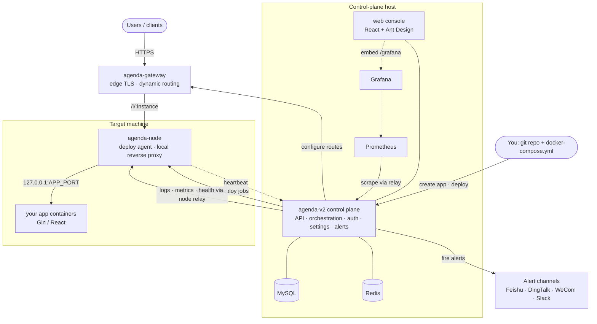

<div align="center">

# Agenda-V2

### Dev infrastructure designed for Vibe Coders

**Deploy, monitor, log, route, and secure production apps — on your own servers, with your data in your own hands.**

[](LICENSE)
[](go.mod)
[](#)
[](#quickstart-single-host)

**English** · [简体中文](README.zh-CN.md)

</div>

---

You don't need a computer-science degree — or Vercel, Supabase, and a stack of SaaS
bills — to run real software. **Agenda-V2** gives you the same deployment,
observability, gateway, and secrets infrastructure that engineering teams rely on,
packaged so you can stand it up yourself and run **production-grade, split
frontend + backend apps** on machines *you* control.

- 🚀 **Ship like a team of ten** — push a git repo + a `docker-compose.yml`, and the
  platform builds, releases, health-checks, and routes it for you.
- 🔒 **Own your data** — everything runs on your servers. No third-party dashboards
  holding your logs, your metrics, or your users.
- 🧰 **Batteries included** — logs, monitoring, dashboards, an edge gateway with
  automatic HTTPS, encrypted secrets, and alerting to Feishu / DingTalk / WeCom /
  Slack, all out of the box.
- 🤖 **Made for AI-assisted builders** — a first-party SDK your apps plug straight
  into, plus a bundled Claude Code skill so your assistant already knows how to
  deploy and instrument on the platform.

> **Status:** actively developed, pre-1.0. APIs and schema may still change.
> Licensed under [AGPL-3.0](LICENSE).

## What it does

- **Deploy orchestration** — build & release Docker Compose apps to one or many
  machines. Two execution modes per machine: classic **SSH**, or the
  **`agenda-node` agent** (a resident per-machine process that replaces "control
  plane SSHes in and runs commands" with a token-authenticated HTTP API). Env-wide
  batch deploys, multiple instances per environment, and blue/green topologies.
- **Built-in gateway** (`agenda-gateway`) — dynamic host/path routing with
  weighted, health-gated backends, per-endpoint metrics (QPS / error rate /
  latency percentiles), and **embedded edge TLS** via ACME DNS-01 (no separate
  Caddy/nginx). See [doc/gateway-edge-tls.md](doc/gateway-edge-tls.md).
  **WebSocket** is supported per route (opt-in), with idle timeouts, connection
  caps, an Origin allowlist, dedicated metrics, and connection draining on
  restart and decommission. See [doc/gateway-websocket.md](doc/gateway-websocket.md).
- **Observability** — per-instance log tailing, Prometheus metrics, and Grafana
  dashboards reverse-proxied under the web console. Apps expose custom metrics
  through the SDK; the control plane scrapes them via the node relay (no direct
  app-port reachability required).
- **Alerting** — a self-built PromQL `AlertRule` engine plus SDK-driven alerts to
  **Feishu / DingTalk / WeCom / Slack / custom webhooks**, every alert also
  landing in a shared in-app notification inbox.
- **Databases** — register a database on any agent-mode machine and run read-only
  SQL against it from the console. Queries are relayed through `agenda-node`, so
  the database port never has to be published; every statement is audited with a
  capped, encrypted copy of its result. See [doc/rds.md](doc/rds.md).
- **Files** — upload a credential from the console and have it delivered to every
  machine running an environment, bind-mounted read-only into the containers at
  `/agenda/files`. Contents are never stored — only a SHA-256, so the platform can
  keep checking that the file is still there and still unchanged, and say so
  before a deploy. See [doc/machine-files.md](doc/machine-files.md).
- **Built-in identity & secrets** — JWT-based auth for users and service
  principals, and a lightweight internal KMS that encrypts secret Settings at rest
  (AES-256-GCM).
- **First-party Go SDK** (`sdk/go`) — drop-in `log`, `metric`, and `alert`
  packages so hosted apps integrate with the platform without bespoke glue.
- **Web console** (`web/`) — a React + Ant Design UI for machines, applications,
  deploys, routes, logs, monitoring, databases, files, alert rules, and settings.

## Architecture



Three independently built, independently deployed binaries share one repo and one
`go.mod`:

| Binary | Role |
|---|---|
| `cmd/agenda-v2` | **Control plane** — API, deploy orchestration, auth, settings, alert engine, web console backend |
| `cmd/agenda-gateway` | **Gateway** — edge TLS termination + dynamic reverse proxy to app backends |
| `cmd/agenda-node` | **Node agent** — per-machine resident process: runs deploy jobs and reverse-proxies gateway traffic to local containers |

Design deep-dive: [doc/agenda-node-tech-design.md](doc/agenda-node-tech-design.md).

## Quickstart (single host)

Requires Docker (with the Compose v2 plugin), plus `curl`, `jq`, and `openssl`.
The script brings up MySQL + Redis + all three binaries + the web console, and
generates all secrets on first run.

```bash
./deploy.sh up                  # build + start the core stack (idempotent)
./deploy.sh up --observability  # also start Prometheus + Grafana
./deploy.sh status              # container state + health endpoints
./deploy.sh logs [service]      # tail logs (all services if omitted)
./deploy.sh down                # stop containers, keep data + secrets
./deploy.sh reset               # stop + wipe volumes AND generated config (destructive)
```

The admin username/password generated on first run are printed at the end of
`up`. This is a single-machine dev/staging quickstart — for a real multi-machine
setup, provision `agenda-node` on each target host and add machines through the
web console. For a remote node, create its Agent Machine first, copy the
ID/token, and run the interactive installer on the target host:

```bash
curl -fsSL https://raw.githubusercontent.com/FredrickUnderwood/Agenda-V2/master/install-node.sh -o install-node.sh
sudo bash install-node.sh
```

It validates the ID/token/control-plane API tuple, prepares persistent config
and workspace directories, and starts the node with Docker Compose. Re-running
it reuses the existing config and updates/rebuilds the container without asking
for the values again; use `--reconfigure` to replace them. See
[`cmd/agenda-node/README.md`](cmd/agenda-node/README.md) for details.

## Deploy your own app

Building an app to host *on* agenda? You deliver a git repo + a `docker-compose.yml`
and integrate the SDK. The bundled Claude Code skill
[`.claude/skills/agenda-app-dev`](.claude/skills/agenda-app-dev/SKILL.md) documents
the full contract — env vars the platform injects, the Gin/React skeletons,
service-to-service calls through the gateway, logging, metrics, and alerting.

## Configuration

Copy the template and fill in the blanks (or let `deploy.sh` render it for you):

```bash
cp config/agenda-v2.example.yaml config/agenda-v2.yaml
```

Real config files (`config/agenda-v2.yaml`, `.env`, keys) are git-ignored — only
`*.example` templates are tracked. Secret Settings can also be managed at runtime
through the API / Settings page and are stored encrypted.

## Repository layout

```
cmd/            control plane, gateway, and node entrypoints
internal/       control-plane + gateway + node implementation
sdk/go/         first-party SDK (log / metric / alert)
web/            React web console
deploy/         quickstart compose + observability stack
config/         config template + loader
doc/            design docs
```

## Development

```bash
go build ./...       # build all binaries
go test ./...        # run the test suite
```

Secret scanning runs on every commit via [pre-commit](https://pre-commit.com) +
[gitleaks](https://github.com/gitleaks/gitleaks). After cloning:

```bash
brew install gitleaks            # or a release binary
pipx install pre-commit          # or: pip install --user pre-commit
pre-commit install
```

## Security

Found a vulnerability? Please report it privately — see [SECURITY.md](SECURITY.md).

## License

[GNU AGPL-3.0](LICENSE). If you run a modified version as a network service, the
AGPL requires you to offer users the corresponding source.
