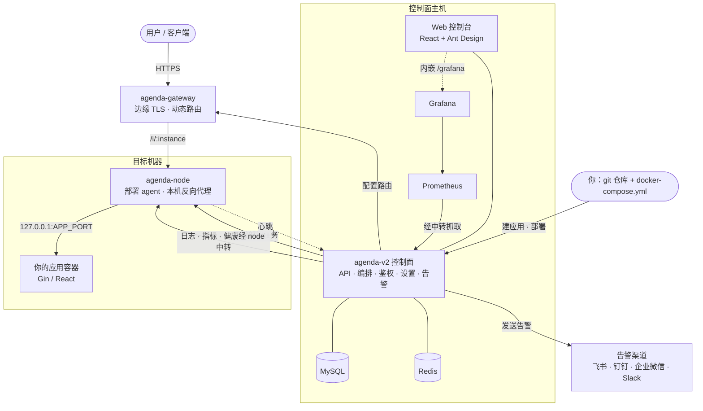

<div align="center">

# Agenda-V2

### 为 Vibe Coders 打造的研发基础设施

**部署、监控、日志、网关、密钥——把生产级应用跑在你自己的服务器上，数据牢牢握在自己手里。**

[](LICENSE)
[](go.mod)
[](#)
[](#快速开始单机)

[English](README.md) · **简体中文**

</div>

---

跑真正的软件，你不需要计算机科班背景——也不需要 Vercel、Supabase 和一堆 SaaS
账单。**Agenda-V2** 把工程团队日常依赖的那套部署、可观测、网关、密钥基础设施打包好，
让你自己就能搭起来，在**你掌控的机器上**跑起**生产级的前后端分离应用**。

- 🚀 **像十人团队一样发布**——推一个 git 仓库 + 一个 `docker-compose.yml`，平台帮你
  构建、发布、健康检查、配置路由。
- 🔒 **数据归你所有**——一切都跑在你自己的服务器上。没有第三方面板替你保管日志、
  指标和用户数据。
- 🧰 **开箱即用**——日志、监控、仪表盘、自动 HTTPS 的边缘网关、加密密钥、以及飞书 /
  钉钉 / 企业微信 / Slack 告警，全部内置。
- 🤖 **为 AI 辅助开发者而生**——应用可直接接入的第一方 SDK，外加一个内置的 Claude Code
  技能，让你的 AI 助手天然就会在平台上部署和打点。

> **状态：** 活跃开发中，pre-1.0，API 与表结构仍可能变化。
> 采用 [AGPL-3.0](LICENSE) 许可。

## 能做什么

- **部署编排**——把 Docker Compose 应用构建并发布到一台或多台机器。每台机器两种执行模式：
  经典 **SSH**，或 **`agenda-node` agent**（常驻每台机器的进程，用 token 鉴权的 HTTP API
  取代"控制面 SSH 进去执行命令"）。支持整环境批量部署、单环境多实例、蓝绿部署。
- **内置网关**（`agenda-gateway`）——按 host/path 动态路由，后端可加权、按健康状态门控，
  提供接口级指标（QPS / 错误率 / 延迟分位），并**内置边缘 TLS**(ACME DNS-01,无需另起
  Caddy/nginx)。见 [doc/gateway-edge-tls.md](doc/gateway-edge-tls.md)。
  **WebSocket** 按路由开关(默认关闭),带空闲超时、连接数上限、Origin 白名单、独立指标,
  以及重启和实例下线时的连接优雅排空。见 [doc/gateway-websocket.md](doc/gateway-websocket.md)。
- **可观测性**——实例级日志 tail、Prometheus 指标、以及反代在控制台下的 Grafana 仪表盘。
  应用通过 SDK 暴露自定义指标；控制面经 node 中转抓取(无需直连应用端口)。
- **告警**——自建 PromQL `AlertRule` 规则引擎，外加通过 SDK 发往
  **飞书 / 钉钉 / 企业微信 / Slack / 自定义 Webhook** 的告警,每条告警同时落到共享的
  站内信收件箱。
- **内置身份与密钥**——面向用户和服务主体的 JWT 鉴权,以及一个轻量内置 KMS,把密钥类
  Settings 加密存储(AES-256-GCM)。
- **第一方 Go SDK**（`sdk/go`）——开箱即用的 `log`、`metric`、`alert` 包,托管应用无需
  自己写胶水代码即可接入平台。
- **Web 控制台**（`web/`）——React + Ant Design 的界面,管理机器、应用、部署、路由、
  日志、监控、告警规则和设置。

## 架构



三个独立编译、独立部署的二进制,共享同一个仓库和同一个 `go.mod`：

| 二进制 | 职责 |
|---|---|
| `cmd/agenda-v2` | **控制面**——API、部署编排、鉴权、设置、告警引擎、Web 控制台后端 |
| `cmd/agenda-gateway` | **网关**——边缘 TLS 终止 + 到应用后端的动态反向代理 |
| `cmd/agenda-node` | **节点 agent**——常驻每台机器的进程：执行部署任务,并把网关流量反代到本机容器 |

设计详解：[doc/agenda-node-tech-design.md](doc/agenda-node-tech-design.md)。

## 快速开始（单机）

需要 Docker(含 Compose v2 插件),以及 `curl`、`jq`、`openssl`。脚本会拉起
MySQL + Redis + 三个二进制 + Web 控制台,并在首次运行时生成所有密钥。

```bash
./deploy.sh up                  # 构建并启动核心栈（幂等）
./deploy.sh up --observability  # 额外启动 Prometheus + Grafana
./deploy.sh status              # 容器状态 + 健康端点
./deploy.sh logs [service]      # tail 日志（省略则全部服务）
./deploy.sh down                # 停容器，保留数据 + 密钥
./deploy.sh reset               # 停止并清空数据卷及生成的配置（破坏性）
```

首次运行生成的管理员用户名/密码会在 `up` 结束时打印。这是单机开发/预发的快速上手,
不是生产拓扑指南——真正多机部署时,在每台目标机器上分别装 `agenda-node`,再通过 Web
控制台添加机器。远程节点可以先在控制台创建 Agent Machine 并复制 ID/token，然后在目标
机器运行交互式安装器：

```bash
curl -fsSL https://raw.githubusercontent.com/FredrickUnderwood/Agenda-V2/master/install-node.sh -o install-node.sh
sudo bash install-node.sh
```

安装器会校验 ID/token/Central API，创建持久化配置和 workspace，并通过 Docker Compose
直接启动节点。再次运行会自动复用已有配置并更新、重建容器，不需要重新填写；只有使用
`--reconfigure` 才会重新采集并替换配置。详细说明见
[`cmd/agenda-node/README.md`](cmd/agenda-node/README.md)。

## 部署你自己的应用

想开发一个**托管在 agenda 上**的应用?你只需交付一个 git 仓库 + 一个 `docker-compose.yml`,
并接入 SDK。内置的 Claude Code 技能
[`.claude/skills/agenda-app-dev`](.claude/skills/agenda-app-dev/SKILL.md) 记录了完整契约——
平台注入的环境变量、Gin/React 骨架、经网关的服务间调用、日志、指标和告警。

## 配置

复制模板填空(或让 `deploy.sh` 帮你渲染)：

```bash
cp config/agenda-v2.example.yaml config/agenda-v2.yaml
```

真实配置文件（`config/agenda-v2.yaml`、`.env`、密钥）都被 git 忽略——只有 `*.example`
模板会被跟踪。密钥类 Settings 也可以在运行时通过 API / 设置页管理,并加密存储。

## 仓库结构

```
cmd/            控制面、网关、节点的入口
internal/       控制面 + 网关 + 节点的实现
sdk/go/         第一方 SDK（log / metric / alert）
web/            React Web 控制台
deploy/         quickstart compose + 可观测栈
config/         配置模板 + 加载器
doc/            设计文档
```

## 开发

```bash
go build ./...       # 构建所有二进制
go test ./...        # 运行测试
```

每次提交都会经 [pre-commit](https://pre-commit.com) +
[gitleaks](https://github.com/gitleaks/gitleaks) 做密钥扫描。clone 后执行：

```bash
brew install gitleaks            # 或下载 release 二进制
pipx install pre-commit          # 或：pip install --user pre-commit
pre-commit install
```

## 安全

发现漏洞?请私密上报——见 [SECURITY.md](SECURITY.md)。

## 许可

[GNU AGPL-3.0](LICENSE)。如果你把修改版作为网络服务运行,AGPL 要求你向用户提供对应的源代码。
