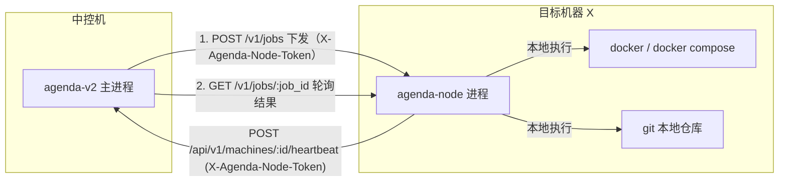
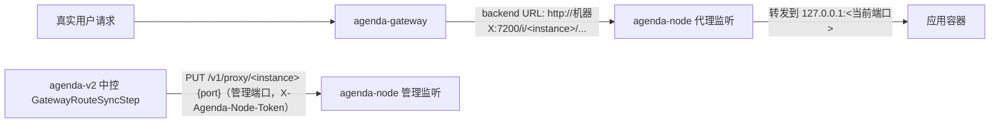

# agenda-node（每机节点代理）技术方案

> 作者：[待填写]
> 日期：2026-07-04
> 版本：v1.1（在部署执行改成"下发+轮询"、新增第 10 节 node 反向代理设计后更新）
> 状态：草稿

---

## 1. 需求背景

最早的 agenda2.0 方案里明确把"每台机器一个代理端口"列为 P1，本期（agenda-v2 一期）不做。目前 agenda-v2 的部署执行链路是：中控进程（`cmd/agenda-v2`）在 `internal/pipeline` 的每个 Step 里调用 `internal/runner.New(machine)`，机器非本地时返回 `sshRunner`，直接用 `ssh`/`sshpass` 从中控进程发起连接执行 `git`/`docker compose` 命令（`internal/runner/runner.go:44-49,96-160`）。

这个模型能跑，但有几个明确的问题：

1. **凭证集中**：所有目标机器的 SSH 私钥/密码都要配置在中控的 `agenda-v2.yaml` 里（`config.MachineConfig.SSHKeyPath/Password`），中控一旦被攻破等于拿到所有机器的登录方式；单台机器要轮换凭证也要改中控配置并重启。
2. **执行是"裸命令"**：`sshRunner` 本质是把任意拼接好的 shell 字符串发过去执行，节点侧没有任何应用层的边界或审计，只有 SSH 本身的日志。
3. **没有独立于"能不能连上"的在线状态**：现在唯一能判断机器是否可用的方式是尝试 SSH 连接（`MachineService.TestConnection`），没有常驻的心跳/在线状态。

本期把这个 P1 项目补上，目标是：**引入 `agenda-node`——部署在每台目标机器上的常驻代理进程，替代"中控直接 SSH 到机器执行命令"这一环节**，同时不推倒现有 SSH 路径（延续 agenda-v2 一贯的做法：新增并行路径，不改已经在跑的旧流程）。

**非目标（本期明确不做）**：
- NAT 穿透/反向长连接（node 主动拨号取任务的模型）——现有 SSH 模型已经要求"中控能直连到机器"，agent 模型延续同样的可达性假设，不解决"机器在防火墙/NAT 后面连不上"的问题，如果以后有这个需求再单独立项。
- 把整条 pipeline（多个 step）一次性整体下发给 node 自行编排——release 状态机、`DeployLog`/`PipelineStep` 持久化、pause/retry/resume 仍然全部留在中控（见 4.1 的方案取舍），node 只负责单个 step 的命令执行，不接管编排。
- node 的多中控高可用/自动发现——一台 node 只认一个中控地址，配置文件里写死。
- 收紧 jobs 的能力边界（把"任意 shell"收窄成"git_pull/compose_up/write_file"等具名操作）——本期先做能力对等的通用 exec，收紧留作后续硬化项，见第 9 节风险。

## 2. 现状回顾（决定了本期设计的落点）

`internal/runner.Runner` 是整个 pipeline 层唯一感知"命令在哪执行"的抽象，接口只有三个方法：

```go
type Runner interface {
    RunCmd(ctx context.Context, dir, name string, args []string, buf *bytes.Buffer) error
    RunCmdEnv(ctx context.Context, dir string, env []string, name string, args []string, buf *bytes.Buffer) error
    RunShell(ctx context.Context, dir, shellCmd string, buf *bytes.Buffer) error
}
```

`runner.New(machine *config.MachineConfig) Runner` 是唯一的选择点（`machine.IsLocal()` 为 true 返回 `localRunner`，否则返回 `sshRunner`）。全部调用方——`GitPullStep`/`ComposePullStep`/`ComposeUpStep`/`ComposeHealthCheckStep`/`ShellStep`（`internal/pipeline/step_*.go`）、`compose_override.go` 的 `writeRemoteFile`/`readRemoteFile`/`ensureRemoteDir`、`MachineService.TestConnection`——都只依赖这三个方法，从不关心背后是本地进程还是 SSH。

**这意味着**：只要新增一个同样实现 `Runner` 接口的 `agentRunner`（内部改成调用 agenda-node 的 HTTP API），`internal/pipeline` 下的所有 Step 文件、`compose_override.go` **零改动**即可获得"通过 agent 执行"的能力。这是本方案能把改动面收得很小的关键前提，也是先读代码而不是先拍脑袋设计接口的原因。

## 3. 整体架构



- **同仓库、不同进程**：`agenda-node` 是 `github.com/FredrickUnderwood/agenda-v2` 仓库里新增的第二个二进制 `cmd/agenda-node`，和 `cmd/agenda-v2` 共享 `internal/runner`、`go.mod`，但独立编译、独立部署、独立生命周期——中控重启不影响已经在跑的 node，反之亦然。
- **三条通信方向，职责不对称**：
  - **中控 → node（下发）**：`POST /v1/jobs` 下发一条命令，node 立即返回 `job_id`（异步受理，不等命令跑完）。
  - **中控 → node（轮询）**：`GET /v1/jobs/:job_id` 按间隔轮询，直到命令跑到终态。对 pipeline 层而言，"下发+轮询"这两步被封装在 `agentRunner` 内部、合并成一次看起来依旧同步的 `RunCmd` 调用——替代的是今天 `sshRunner` 的角色，细节见 4.1/4.2。
  - **node → 中控（心跳）**：异步心跳，"我还活着"，让中控有一个不依赖"临时发起一次连接测试"的在线状态。这条方向不能反过来（不做"中控主动探活 node"），避免同一件事有两条不同的路要维护。

## 4. 关键设计点

### 4.1 执行模型评估：为什么用"下发+轮询"而不是一次同步调用

最初的草稿是中控同步 POST 一次 `/v1/exec`，HTTP 请求一直挂到命令跑完再返回。用户提出的方案是反过来：中控把指令"下达"给 node（node 立即确认收到，不等跑完），node 自己跑，中控之后定时轮询结果。这里评估一下两种方式：

| | 同步 `/v1/exec`（旧草稿） | 下发 + 轮询（本次采纳） |
|---|---|---|
| 长时间命令（`docker compose up --build` 拉大镜像，可能几分钟） | 必须一直挂着一个 HTTP 连接，中间任何一次网络抖动、中控自身重启、经过的反代/负载均衡器的空闲超时，都会打断这个连接——而中控**无法区分**"命令还在跑"和"连接断了、命令死活不知道" | 命令在 node 上是独立跑的，不依赖某一次 HTTP 连接存活；中控只是不断地问"跑完了没"，某次轮询失败/超时，下次再问一次即可，不影响 node 上命令本身的执行 |
| 失败语义 | 连接断 = 这一步直接判失败，即使命令本来可能会成功 | 只有 node 进程本身挂掉（重启/崩溃）才会让"跑到一半的任务"真正丢失，比"连接断了就算失败"要坚固 |
| 实现复杂度 | 简单，一次请求一次响应 | 需要 node 侧维护一个任务表（job store）+ 过期清理；多了一次轮询请求 |
| 对中控现有代码的影响 | 无 | 无——只要把"下发+轮询直到终态"这套逻辑封在 `agentRunner` 内部，对外仍然表现为一次阻塞式调用，`internal/pipeline`/`internal/application` 一行代码都不用改（见下） |

**结论：采纳"下发+轮询"**。这个方案原本要解决的"直接 SSH 到远程机器部署感觉危险"这个问题，agent 化本身（用 token 代替 SSH 凭证、把裸命令收敛成结构化 API）已经解决了一大半；轮询模型进一步解决的是**长命令期间连接必须存活**这个残留的脆弱点，两者不冲突、是互相补充的两层加固，值得一起做。代价是 node 侧要多维护一个任务表，评估下来这个复杂度可控（详见 4.3），值得换这份健壮性。

### 4.2 Runner 抽象扩展：`agentRunner` 内部做"下发 + 轮询"，对外仍是一次阻塞调用

`internal/runner/runner.go` 的 `New` 增加一个分支，按 `MachineConfig.Mode` 选择实现：

```go
type MachineConfig struct {
    // ...existing fields...
    Mode             string        // "ssh"（默认，兼容现状）| "agent"
    AgentBaseURL     string        // 如 "http://10.0.0.10:7100"
    AgentToken       string        // 该机器 node 的共享密钥
    AgentPollInterval time.Duration // 轮询间隔，默认 2s（走全局 deploy.agent_poll_interval）
}

func New(machine *config.MachineConfig) Runner {
    if machine.IsLocal() {
        return &localRunner{}
    }
    if machine.Mode == "agent" {
        return &agentRunner{machine: machine}
    }
    return &sshRunner{machine: machine}
}
```

新文件 `internal/runner/agent_runner.go`：

```go
type agentRunner struct {
    machine *config.MachineConfig
    client  *http.Client
}

// dispatchRequest 是 POST /v1/jobs 的请求体。JobID 由调用方（中控）生成，
// 保证幂等：同一个 JobID 重复下发，node 直接返回已有任务的状态，不会重复起一个
// docker compose up，避免"下发请求本身超时重试"导致的重复执行。
type dispatchRequest struct {
    JobID string   `json:"job_id"`
    Dir   string   `json:"dir"`
    Env   []string `json:"env,omitempty"`
    Mode  string   `json:"mode"` // "cmd" | "shell"
    Name  string   `json:"name,omitempty"`
    Args  []string `json:"args,omitempty"`
    Shell string   `json:"shell,omitempty"`
}

type jobStatus struct {
    Status   string `json:"status"` // "running" | "success" | "failed"
    ExitCode int    `json:"exit_code"`
    Output   string `json:"output"` // 当前已产生的输出快照（running 阶段也可读到部分输出，见 4.3）
    Error    string `json:"error,omitempty"`
}

// run 是 RunCmd/RunCmdEnv/RunShell 共用的内部实现：下发一次，之后按
// AgentPollInterval 轮询直到 status 为终态或 ctx 被取消。对调用方（pipeline
// 层）而言，这个函数和 sshRunner/localRunner 的对应方法一样是阻塞到返回结果。
func (a *agentRunner) run(ctx context.Context, req dispatchRequest, buf *bytes.Buffer) error {
    req.JobID = uuid.NewString()
    if err := a.postJSON(ctx, "/v1/jobs", req, nil); err != nil {
        return err
    }
    ticker := time.NewTicker(a.pollInterval())
    defer ticker.Stop()
    // 无论正常结束还是 ctx 超时/取消，都尽力通知 node 回收这个任务，
    // 避免中控放弃轮询后 node 上还留着一个没人再看的 docker build 进程。
    defer func() {
        _ = a.deleteJSON(context.WithoutCancel(ctx), "/v1/jobs/"+req.JobID)
    }()
    for {
        select {
        case <-ctx.Done():
            return ctx.Err()
        case <-ticker.C:
            var st jobStatus
            if err := a.getJSON(ctx, "/v1/jobs/"+req.JobID, &st); err != nil {
                // 一次轮询失败（网络抖动）不算任务失败，下一个 tick 再试；
                // node 进程真的挂了的话，ctx 超时会兜底结束这个循环。
                continue
            }
            buf.WriteString(st.Output)
            switch st.Status {
            case "success":
                return nil
            case "failed":
                return errors.New(st.Error)
            }
        }
    }
}
```

`RunCmd`/`RunCmdEnv`/`RunShell` 都是薄封装，拼好 `dispatchRequest` 后调 `run`。`ctx` 直接来自调用方——`pipeline.Runner` 的 `runAsync` 已经用 `cfg.Deploy.DefaultTimeout` 包了一层 ctx，agent 模式的轮询循环天然受它约束，不需要单独再定义一套超时语义。

### 4.3 agenda-node 自身：任务表 + 复用 `runner.New(nil)`

node 进程不需要重新实现"跑命令"的逻辑——`runner.New(nil)` 本来就返回 `&localRunner{}`（`MachineConfig.IsLocal()` 对 nil receiver 也成立），node 侧收到一个任务后，直接开一个 goroutine 调用 `r.RunCmd`/`RunCmdEnv`/`RunShell`，把结果写进内存里的任务表：

```go
// internal/node/jobstore.go
type job struct {
    status   string // running | success | failed
    exitCode int
    buf      bytes.Buffer // 命令仍在运行时也可以被并发读取到"当前已有输出"
    err      string
    doneAt   time.Time
}

type JobStore struct {
    mu   sync.Mutex
    jobs map[string]*job
}

// Dispatch 是幂等的：job_id 已存在就直接返回，不重新起一次命令。
func (s *JobStore) Dispatch(id string, run func(ctx context.Context, buf *bytes.Buffer) error) {
    s.mu.Lock()
    if _, exists := s.jobs[id]; exists {
        s.mu.Unlock()
        return
    }
    j := &job{status: "running"}
    s.jobs[id] = j
    s.mu.Unlock()

    go func() {
        ctx, cancel := context.WithTimeout(context.Background(), maxJobDuration)
        defer cancel()
        err := run(ctx, &j.buf)
        s.mu.Lock()
        defer s.mu.Unlock()
        j.doneAt = time.Now()
        if err != nil {
            j.status, j.err = "failed", err.Error()
        } else {
            j.status = "success"
        }
    }()
}
```

- **过期清理**：后台 goroutine 定期扫一遍 `jobs`，把 `doneAt` 超过 `job_retention`（默认 1 小时）的任务删掉，防止内存无限增长——node 不需要持久化任务历史，中控的 `PipelineStep`/`DeployLog` 才是权威记录。
- **崩溃语义**：node 进程重启会丢掉内存里所有任务状态。中控轮询到 404（job 不存在）且这个 job_id 确实之前下发成功过，判定为"任务丢失/node 重启"，直接判该 step 失败——这不是新增的失败模式，和现状"SSH 会话中途断开、命令生死不明只能判失败"是同一类结果，只是现在更少发生（只在 node 真的重启/崩溃时才触发，而不是任何一次网络抖动都触发）。
- **删除任务**（`DELETE /v1/jobs/:job_id`）：中控放弃轮询（ctx 超时/取消）时尽力调一次，如果命令还在跑，node 侧 `cancel()` 掉对应的 `run` 的 ctx，及时终止一个已经没有人关心结果的进程，避免残留孤儿进程占用资源。注意 `pipeline.Runner` 现状的 pause 是在 step **边界**生效（`shouldPause` 只在两个 step 之间检查），不会打断正在轮询中的这一个 step，所以这里的取消只会在整体 ctx 超时/deploy 彻底放弃时触发，不会和正常的 pause 流程冲突。

输出截断（`max_output_bytes`）在写入 `j.buf` 时做，和中控侧 `capOutput` 的策略一致，双重防御。

### 4.4 鉴权模型：按机器颁发的共享密钥，两个方向复用同一个 token

- 每台机器一个 `agent_token`，创建/编辑 Machine 时生成，存 `machine.agent_token`（明文存库，和现有 `machine.password` 字段的存法一致，不是本期新引入的安全水位下降）。
- node 自己的本地配置文件 `agenda-node.yaml` 里配同一个 token（部署 node 时人工/脚本下发）。
- **中控 → node**：请求带 `X-Agenda-Node-Token`，node 校验等于自己配置文件里的 token。
- **node → 中控**（心跳）：同一个 token 放在 `X-Agenda-Node-Token`，中控按 URL 里的 `:id` 查出对应 `machine.agent_token` 比对——这是一条新的、独立于现有全局 `server.auth_token` 管理员 bearer 认证之外的认证路径，因为发起方是 node 不是持有管理员 token 的前端/运维,不能复用 `bearerAuth` 中间件。

### 4.5 心跳与在线状态

`Machine` 新增 `agent_last_heartbeat_at`/`agent_version` 两列（不建单独的心跳历史表——只关心"最新一次"，不需要历史，遵循项目一贯的"够用就好、不为假设的未来需求建表"）。

node 启动后每 `heartbeat_interval`（默认 15s）POST 一次：

```
POST /api/v1/machines/:id/heartbeat
X-Agenda-Node-Token: <token>
{ "version": "0.1.0" }
```

中控更新 `agent_last_heartbeat_at=now()`。在线判定是纯读时计算（不需要后台扫描/定时任务）：`online = agent_last_heartbeat_at != nil && now - agent_last_heartbeat_at < 3*heartbeat_interval`，暴露在 `GET /api/v1/machines`/`GET /api/v1/machines/:id` 的响应里供前端展示，不新增第二条"中控主动探活 node"的健康检查——现有的 `ApplicationHealthService` 检查的是"应用实例"健康，这里是"节点本身"是否在线，两件事故意不合并、不复用同一张表，因为语义不同（一个是应用容器健康，一个是执行通道是否可达），但都用"心跳/主动探测→按 last_seen 判定"这同一种模式，不是发明新机制。

### 4.6 增量迁移与回退：`Mode` 是每台机器独立的开关，不是全局切换

`Machine.Mode` 默认 `ssh`。已经在用的机器不受影响；新机器或者想切的机器单独改成 `agent`。这条路径不设计"运行时自动降级"——如果某台机器 `Mode=agent` 但 node 挂了/心跳过期，部署请求应该直接失败并报出明确错误（"agent unreachable"),而不是静默 fallback 回 SSH。理由：
1. 静默切回 SSH 意味着中控必须**永远**在配置里保留这台机器的 SSH 凭证作为"备胎"，这就违背了本期"用 token 代替 SSH 私钥分发"的初衷。
2. 一次部署执行到一半如果因为通道抖动中途切换执行方式，会让"这个 release 到底是通过哪条链路部署的"这件事变得不可审计。

出问题的应对手段是运维手动把这台机器的 `Mode` 改回 `ssh`（配置照旧还在，没有被本期删除），这是一个显式的、有记录的操作，不是自动兜底。

### 4.7 node 自身的部署引导（鸡生蛋问题）

`agenda-node` 要跑在目标机器上才能被"切到 agent 模式"，但它自己怎么第一次装上去？——本期不解决"用 agenda-node 部署 agenda-node"的循环依赖,第一次上线用现有 SSH 路径装一次：

1. 机器仍然是 `Mode=ssh`，用现有 pipeline（或者一次性运维脚本）把 `agenda-node` 二进制/`systemd` unit（或作为一个独立的 `docker-compose` 服务）铺到目标机器，写好它的 `agenda-node.yaml`（`machine_id`/`token`/`central_base_url`），启动。
2. 确认心跳到达中控（`agent_last_heartbeat_at` 有值）。
3. 把这台 `Machine.Mode` 改成 `agent`,后续这台机器上所有的 release 部署都走 node。

`agenda-node` 自身的升级同理：第一版可以先靠"运维手动/脚本重启",不在本期范围内做"中控远程升级 node 二进制"这个更复杂的自举能力。

### 4.8 安全边界

`/v1/jobs` 本质上等价于在目标机器上任意执行代码（和现状 SSH 权限对等，不是新增的风险类别）。收敛措施：
- node 只监听内网地址（配置项 `listen_addr`，默认 `127.0.0.1:7100` 或私网网卡地址，不监听 `0.0.0.0` 暴露到公网）。
- 建议在网络层（安全组/防火墙）限制只有中控机的出口 IP 能访问该端口,和现状"只允许中控 IP 发起 SSH"是同一件事换了个端口号。
- token 可以按机器单独轮换/吊销（改 `machine.agent_token` + 同步改 node 本地配置重启即可),比"改一台机器的 SSH 授权公钥"更轻量,这是相对现状的实际收益,不是share了不安全的假设。
- 后续硬化方向（本期不做，留在风险里）：把 `/v1/jobs` 收窄成具名操作（`git_pull`/`compose_up`/`write_file` 等），而不是接受任意 `name+args`/`shell` 字符串,能力收窄后单个 token 泄漏的影响面更小。

## 5. 数据库变更

`machine` 表新增 6 列（新增 alter 迁移文件，不改 `0001_init_schema.sql`——迁移只增不改是既有约定；`agent_proxy_base_url` 是第 10 节"node 反向代理"设计需要的字段，和其余 5 列一起放进同一次 alter，不额外开一次迁移）：

```sql
-- resources/migrations/0002_machine_agent_mode.sql
ALTER TABLE machine
    ADD COLUMN mode VARCHAR(16) NOT NULL DEFAULT 'ssh' AFTER auth_type,
    ADD COLUMN agent_base_url VARCHAR(255) NOT NULL DEFAULT '' AFTER mode,
    ADD COLUMN agent_proxy_base_url VARCHAR(255) NOT NULL DEFAULT '' AFTER agent_base_url,
    ADD COLUMN agent_token VARCHAR(255) NOT NULL DEFAULT '' AFTER agent_proxy_base_url,
    ADD COLUMN agent_last_heartbeat_at DATETIME(3) NULL AFTER agent_token,
    ADD COLUMN agent_version VARCHAR(32) NOT NULL DEFAULT '' AFTER agent_last_heartbeat_at;
```

对应 `domain.Machine` 新增字段：

```go
type MachineMode string

const (
    MachineModeSSH   MachineMode = "ssh"
    MachineModeAgent MachineMode = "agent"
)

type Machine struct {
    // ...existing fields...
    Mode                 MachineMode `json:"mode"                    gorm:"size:16;not null;default:ssh"`
    AgentBaseURL         string      `json:"agent_base_url"          gorm:"size:255;not null;default:''"`
    AgentProxyBaseURL    string      `json:"agent_proxy_base_url"    gorm:"size:255;not null;default:''"` // node 反向代理端口地址，见第 10 节
    AgentToken           string      `json:"-"                       gorm:"size:255;not null;default:''"`
    AgentLastHeartbeatAt *time.Time  `json:"agent_last_heartbeat_at"`
    AgentVersion         string      `json:"agent_version"           gorm:"size:32;not null;default:''"`
}
```

`AgentToken` 和现有 `Password` 一样打 `json:"-"`，不在任何 API 响应里回显。

## 6. API 设计

### 6.1 agenda-node 暴露的 API（新进程，新端口）

| 方法 | 路径 | 说明 |
|------|------|------|
| POST | `/v1/jobs` | 下发一条命令（cmd 或 shell 模式），立即返回 `{job_id}`（202），命令在后台异步执行；`job_id` 由中控生成并保证幂等，重复下发同一个 `job_id` 不会重复起任务 |
| GET | `/v1/jobs/:job_id` | 查询任务当前状态：`running`/`success`/`failed` + 已产生的输出快照 + exit_code；不存在返回 404（任务已过期被 GC，或 node 重启后丢失） |
| DELETE | `/v1/jobs/:job_id` | 尽力取消一个仍在运行的任务（中控放弃轮询时调用，非必需，用于回收孤儿进程） |
| GET | `/v1/health` | 存活探测，返回 `{version, uptime_sec}`，不需要 token（仅用于本机 `docker healthcheck`/`systemd` 探活，不对外暴露业务能力） |

### 6.2 agenda-v2 中控新增/变更 API

| 方法 | 路径 | 说明 | 鉴权 |
|------|------|------|------|
| POST | `/api/v1/machines/:id/heartbeat` | node 上报心跳 | `X-Agenda-Node-Token` 按 `:id` 比对 `machine.agent_token`,不走全局 `bearerAuth` |
| PUT | `/api/v1/machines/:id` | 沿用现有 Machine Update，`UpdateMachineRequest` 增加 `mode`/`agent_base_url`/`agent_proxy_base_url`/`agent_token` 四个可选字段 | 现有全局 `bearerAuth` |
| GET | `/api/v1/machines`、`/api/v1/machines/:id` | 响应体增加 `mode`/`agent_last_heartbeat_at`/`agent_version`/派生字段 `online: bool` | 现有全局 `bearerAuth` |

## 7. 配置样例

`agenda-node.yaml`（node 进程自己的配置，独立于 `agenda-v2.yaml`）：

```yaml
listen_addr: "0.0.0.0:7100"        # 管理端口：/v1/jobs、/v1/proxy、/v1/health，建议只在私网网卡监听
proxy_listen_addr: "0.0.0.0:7200"  # 反向代理端口：承接 gateway 转发来的业务流量，见第 10 节
machine_id: 3                  # 对应中控 machine 表的 id，需要和中控协调一致
token: "replace-with-random-secret"
central_base_url: "http://10.0.0.1:8080"
heartbeat_interval: "15s"
max_output_bytes: 65536
job_retention: "1h"            # 已完成任务在内存里保留多久，超过被 GC
```

`agenda-v2.yaml` 的 `machines` 段 + `deploy` 段新增字段示例：

```yaml
deploy:
  max_output_bytes: 65536
  default_timeout: "5m"
  agent_poll_interval: "2s"    # agentRunner 轮询 node 任务状态的间隔

machines:
  prod-1:
    machine_type: prod
    mode: agent
    agent_base_url: "http://10.0.0.10:7100"
    agent_proxy_base_url: "http://10.0.0.10:7200"   # 见第 10 节，gateway 的 backend URL 会指向这里
    agent_token: "replace-with-random-secret"   # 与 prod-1 机器上 agenda-node.yaml 的 token 一致
    workspace_root: "/root/.agenda-v2/workspaces"
  prod-2:
    machine_type: prod
    mode: ssh                                    # 未迁移的机器继续走现状
    host: 10.0.0.11
    user: deploy
    ssh_key_path: "~/.ssh/id_rsa"
```

## 8. 任务分解

| 编号 | 任务 | 说明 | 依赖 |
|------|------|------|------|
| T1 | DB 迁移 + domain.Machine 扩展 | `0002_machine_agent_mode.sql`，`Machine`/`MachineConfig` 新增字段 | 无 |
| T2 | `internal/runner.agentRunner` | 新文件，实现 `Runner` 接口：下发任务 + 轮询直到终态，带幂等 `job_id`、ctx 取消时尽力 `DELETE` 回收 | T1 |
| T3 | `cmd/agenda-node` + `internal/node` | 新二进制：Gin 服务（`/v1/jobs`、`/v1/jobs/:job_id`、`/v1/health`）+ 内存任务表（`JobStore`，含过期 GC）+ 心跳后台 goroutine + 独立配置加载 | 无（可与 T1/T2 并行） |
| T4 | 中控心跳接收端点 | `POST /api/v1/machines/:id/heartbeat`，独立鉴权中间件，写 `agent_last_heartbeat_at`/`agent_version` | T1 |
| T5 | Machine 管理 API/响应扩展 | `UpdateMachineRequest` 新字段；列表/详情响应带 `online` 派生字段 | T1 |
| T6 | `MachineService.TestConnection` 适配 agent 模式 | 复用 `runner.New(mc)` 天然生效，补充：当 `Mode=agent` 且从未心跳过时给出更明确的报错文案 | T1,T2 |
| T7 | node 部署产物 | `agenda-node` 的 `docker-compose.yml`/`Dockerfile` 或 `systemd` unit 模板 + 部署说明文档 | T3 |
| T8 | 联调 | 挑一台现网机器，SSH 装 node → 确认心跳 → 切 `Mode=agent` → 跑一次真实 release 部署验证 pipeline 全链路，重点验证一次跨多个轮询周期的长 `compose_up --build` | T1-T7 |
| T9（可选，锦上添花） | 运行中任务的输出实时回填 | `runOne` 每次轮询到 `running` 状态时，也把当前输出快照写回 `PipelineStep.Output`（而不是只在终态写一次），前端可以看到长 step 的部分实时输出——poll 模型天然支持，成本很低，非必需可延后 | T2,T3 |

## 9. 风险与后续

| 风险 | 说明 | 缓解/后续动作 |
|------|------|----------------|
| jobs 能力等价于 RCE | 已在 4.8 说明和现状 SSH 对等，不是新增风险类别 | 后续可选：把 `/v1/jobs` 收窄成具名操作 |
| node 进程崩溃导致任务表清空、跑到一半的任务状态丢失 | 中控轮询到 404，判该 step 失败，走现有的"从某一步重试"机制 | 建议 node 部署为 `systemd` 服务并开 `Restart=always`，写进 T7 的部署文档；不做任务持久化到磁盘（复杂度换来的收益有限，本期不做） |
| 任务表内存无限增长 | 一直有新任务下发但没有 GC | `job_retention` 到期清理（4.3），加一个后台 goroutine，逻辑简单 |
| 轮询间隔引入的"完成感知延迟" | 命令实际已经跑完，但中控要等到下一个 tick 才知道 | 默认 2s 级别的延迟对部署场景可接受，非实时系统；如果嫌慢可以调小 `agent_poll_interval`，不需要架构变化 |
| 心跳飘移导致误判在线/离线 | 网络抖动导致单次心跳丢失 | 判定窗口给了 3 倍心跳间隔的余量（见 4.5），不做一次丢失就判离线 |
| 两套鉴权体系（管理员 bearer + 每机 agent token）增加认知成本 | 是刻意的——管理员 token 和"某台机器的执行权限"本来就是两种不同的信任边界，不应该混用同一个 token | 无需缓解，按设计如此 |

---

## 10. 附加设计：node 作为本机反向代理（承接网关流量）

### 10.1 背景与目标

除了替代 SSH 执行部署，node 还要承担网关侧的一个职责：**本机反向代理**——`agenda-gateway` 的 backend 不再直接指向应用容器的动态端口，而是指向同一台机器上 `agenda-node` 的一个固定代理端口，由 node 转发到本机当前实际监听的容器端口。

现状（`internal/pipeline/step_gateway.go` + `internal/pipeline/builder.go` 的 `backendSpecForTarget`/`resolveBackendHost`）：`GatewayRouteSyncStep` 算出来的 `GatewayBackendSpec.URL` 直接是 `<scheme>://<machine.Host>:<envTarget.Port><backendPath>`——也就是说 `agenda-gateway` 必须能直接拿网络访问到每台机器上每个应用实例当前的动态端口。这一点和最开始"中控直连机器执行部署"是同一类问题：**gateway 要直连一个会变的、暴露在外的端口**。

引入 node 反向代理之后：
1. **gateway 不用再关心真实端口是多少**——它只需要知道"这个 instance 在哪台机器的 node 代理端口上"，端口漂移（比如同一实例重新部署后 `APP_PORT` 变了）对 gateway 而言是透明的，node 内部自己维护"当前这个 instance 该转发到本机哪个端口"。
2. **应用容器端口可以收得更紧**——docker compose 的端口映射可以改成只绑定 `127.0.0.1`（而不是 `0.0.0.0`），因为只有本机的 node 需要访问它，gateway 和其它任何机器都不再需要直连它。整台机器上唯一需要对外（对 gateway）暴露的端口就是 node 的代理端口，攻击面进一步收敛，和最初"用 agenda-node 替代 SSH 降低风险"的诉求是同一个方向的延伸。
3. node 已经是这台机器上跑部署的那个进程，天然知道"这次部署把 instance 跑在了哪个端口"——反向代理这件事放在 node 上做，不需要引入第三方组件。

**非目标（本期不做）**：
- node 侧不做健康感知/熔断——是否把流量路由到这个 backend，仍然完全由 `ApplicationHealthService` + gateway 的 `Healthy` 标记决定（见 4.5 之外，现状机制不变）；node 的代理是"哑转发"，不重复实现一遍健康判断逻辑。
- 不支持 node 跨机器代理（一个 node 只转发到本机 `127.0.0.1`，不做"帮别的机器转发"这种更复杂的拓扑）。

### 10.2 整体设计



node 进程对外开**两个**端口，职责分离，不复用同一个监听：

| 端口 | 用途 | 鉴权 | 流量特征 |
|------|------|------|----------|
| 管理端口（如 `:7100`） | `/v1/jobs`、`/v1/jobs/:job_id`、`/v1/proxy/:instance_name`、`/v1/health` | `X-Agenda-Node-Token` | 低频、高信任（等价 RCE/路由配置变更） |
| 代理端口（如 `:7200`） | 承接 gateway 转发来的真实业务流量，反向代理到本机容器端口 | 不需要 token——和现状"容器端口直接暴露给 gateway、零额外鉴权"是同一个信任边界，鉴权已经在 gateway 层做过 | 高频、纯转发，要快 |

**注册时机**：backend 端口信息由 `GatewayRouteSyncStep` 在同步网关路由**之前**，先调一次 node 的 `PUT /v1/proxy/:instance_name`，告诉 node "这个 instance 现在应该转发到本机哪个端口"，再调 `gateway.Client.UpsertRoute` 把 backend URL（此时已经指向 node 代理端口）同步给 `agenda-gateway`。两次调用都在同一个 step 里顺序执行，任何一次失败这个 step 就失败（和现状"整个 step 要么都成功要么失败"的粒度一致，不引入新的部分失败态）。

**为什么放在 `GatewayRouteSyncStep` 而不是 `ComposeUpStep`**：`ComposeUpStep` 现状完全不感知网关/路由（只管把容器跑起来），这是既有的职责边界；`GatewayRouteSyncStep` 本来就是唯一"网关感知"的 step，已经手握 `instance_name`/`port`/`machine`，加一次调用是最小改动，`ComposeUpStep`/`internal/runner`（4.1-4.3 设计的执行模型）完全不用感知代理这件事——两个能力（执行部署 vs 网关代理）在 node 内部也是两套独立子系统，互不感知。

**为什么注册在 compose_healthcheck 之后而不是提前**：`GatewayRouteSyncStep` 在 pipeline 里的顺序本来就在 `compose_healthcheck` 之后（现状不变），所以即使 node 提前知道了端口，实际把这个 backend 写进 gateway 路由（真正开始收到用户流量的时刻）仍然要等健康检查通过——顺序上没有提前暴露未就绪实例的风险。

### 10.3 Backend URL 解析规则变更（仅 agent 模式）

`builder.go` 的 `backendSpecForTarget`/`resolveBackendHost`/`buildGatewayRouteSync` 现在按 `machine.Mode` 分支：

```go
func (b *Builder) resolveBackendURL(machine *config.MachineConfig, instanceName string, port int, backendPath string) string {
    if machine != nil && machine.Mode == "agent" && machine.AgentProxyBaseURL != "" {
        // 代理模式：URL 指向 node 的代理端口 + /i/<instance>，端口号本身不再出现在 URL 里，
        // node 内部按 instance_name 查当前应该转发到哪个本地端口。
        return strings.TrimRight(machine.AgentProxyBaseURL, "/") + "/i/" + instanceName + backendPath
    }
    // ssh/local 模式：维持现状，直接指向真实端口
    host := b.resolveBackendHost(machine)
    return backendURL(b.cfg.Gateway.BackendScheme, host, port, backendPath)
}
```

`port` 本身仍然要传给 node（通过 `PUT /v1/proxy/:instance_name`），只是不再出现在 gateway 看到的 URL 里——gateway 眼里这个 backend 的地址永远是"机器 X 的 node 代理端口 + 固定的 instance 路径"，稳定不变，即使这个 instance 下次部署换了端口。

`MachineConfig`/`domain.Machine` 各新增一个字段：

```go
type MachineConfig struct {
    // ...
    AgentProxyBaseURL string // 如 "http://10.0.0.10:7200"，node 代理端口的对外地址
}
```

### 10.4 node 侧新增能力

**代理注册表**（内存，不持久化——和 job store 一样，重启即丢，靠中控在下次部署/心跳周期重新同步）：

```go
// internal/node/proxy_registry.go
type ProxyRegistry struct {
    mu     sync.RWMutex
    routes map[string]int // instance_name -> local port
}

func (r *ProxyRegistry) Set(instance string, port int) { ... }
func (r *ProxyRegistry) Get(instance string) (int, bool) { ... }
```

**反向代理 handler**（代理端口，无 token）：

```go
// internal/node/proxy_handler.go
func (h *ProxyHandler) ServeHTTP(w http.ResponseWriter, r *http.Request) {
    instance, rest, ok := splitInstancePrefix(r.URL.Path) // "/i/<instance>/xxx" -> ("<instance>", "/xxx")
    if !ok {
        http.NotFound(w, r)
        return
    }
    port, ok := h.registry.Get(instance)
    if !ok {
        http.Error(w, "unknown instance", http.StatusBadGateway)
        return
    }
    target := &url.URL{Scheme: "http", Host: "127.0.0.1:" + strconv.Itoa(port)}
    proxy := httputil.NewSingleHostReverseProxy(target)
    r.URL.Path = rest
    proxy.ServeHTTP(w, r)
}
```

`httputil.ReverseProxy` 是标准库现成的反向代理实现，不需要自己写转发逻辑——本期唯一要写的是"根据 URL 前缀解析出 instance、查表拿到当前端口"这一小段路由逻辑。

**注册 API**（管理端口，需要 token，和 `/v1/jobs` 同一套鉴权中间件）：

```
PUT /v1/proxy/:instance_name
X-Agenda-Node-Token: <token>
{ "port": 18080 }
```

node 侧收到后 `registry.Set(instanceName, port)`，立即生效，无需重启。

### 10.5 中控侧新增能力

`internal/gateway`（或新增一个和它平级的小包，比如 `internal/nodeproxy`，避免和已有的 `internal/gateway.Client`——调用 `agenda-gateway` 管理 API 的客户端——混在一起）新增一个薄客户端，复用 `agentRunner` 已经封装好的"node 管理端口 + token"这套 HTTP 调用逻辑（避免重复实现一遍鉴权 header/超时/错误处理）：

```go
// internal/runner 或 internal/nodeproxy
func RegisterProxyTarget(ctx context.Context, machine *config.MachineConfig, instanceName string, port int) error {
    // POST/PUT machine.AgentBaseURL + "/v1/proxy/" + instanceName，带 X-Agenda-Node-Token
}
```

`GatewayRouteSyncStep.Execute` 在 agent 模式下，先调这个函数，再调现有的 `s.Client.UpsertRoute`。ssh/local 模式的机器完全跳过这一步（`machine.Mode != "agent"` 直接走现状逻辑），零影响。

### 10.6 任务分解（追加）

| 编号 | 任务 | 说明 | 依赖 |
|------|------|------|------|
| T10 | node 双监听 + `ProxyRegistry` | `internal/node` 新增代理端口监听（`httputil.ReverseProxy`）+ 内存注册表 | T3 |
| T11 | node 代理注册 API | `PUT /v1/proxy/:instance_name`，走管理端口既有鉴权中间件 | T10 |
| T12 | 中控侧注册客户端 | 新增薄 HTTP 客户端（`RegisterProxyTarget`），复用 agent 的 base_url/token 配置 | T2 |
| T13 | `GatewayRouteSyncStep`/`builder.go` 改造 | agent 模式下：先注册代理目标，再用 node 代理地址构造 backend URL（10.3） | T12,T1（`AgentProxyBaseURL` 字段） |
| T14 | 联调 | 验证换端口重新部署后，gateway 路由不变、流量仍能正确转发到新端口 | T10-T13,T8 |

### 10.7 风险（追加）

| 风险 | 说明 | 缓解/后续动作 |
|------|------|----------------|
| node 代理端口是新的单点 | node 挂了，这台机器上所有走代理模式的 instance 都无法访问，即使容器本身是健康的 | 和第 9 节"node 进程崩溃"是同一个风险来源，缓解手段一致：`systemd Restart=always`；如果对可用性要求更高，后续可以让 `ApplicationHealthService` 把"node 心跳是否新鲜"也纳入这个 instance 的健康判断，暂不在本期做 |
| 代理注册表是内存态，node 重启后为空 | node 刚重启、还没收到任何 `PUT /v1/proxy` 之前，这段时间内该机器上的 instance 全部 502 | 心跳一旦恢复，运维可以主动触发一次"重新同步"（比如对该机器下所有 agent 模式 instance 重放一次 gateway_routes_sync，具体接口留到实现阶段设计，属于恢复流程而非本期必须的新能力） |
| 容器端口收紧到 `127.0.0.1` 需要用户自己改 compose 文件 | 本期只提供能力，不强制/自动改用户的 `docker-compose.yml` 端口绑定 | 文档里说明推荐做法，不做强制校验 |
