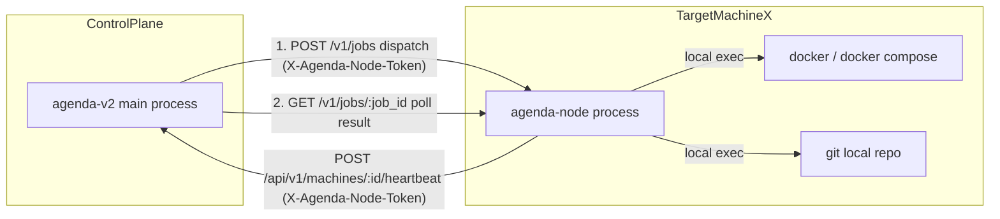
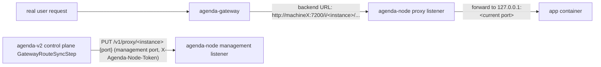

# agenda-node (per-machine node agent) — technical design

> Author: —
> Date: 2026-07-04
> Version: v1.1 (updated after switching deploy execution to "dispatch + poll" and adding the node reverse-proxy design in section 10)
> Status: Draft

---

## 1. Background

The earliest agenda 2.0 proposal explicitly listed "one proxy port per machine"
as a P1 item, which the current phase (agenda-v2 phase 1) does not do. Today
agenda-v2's deploy execution path is: the control-plane process
(`cmd/agenda-v2`) calls `internal/runner.New(machine)` in every Step under
`internal/pipeline`; when the machine is not local it returns an `sshRunner`,
which uses `ssh`/`sshpass` from the control-plane process to connect and run
`git`/`docker compose` commands directly (`internal/runner/runner.go:44-49,96-160`).

This model works, but has a few clear problems:

1. **Credential concentration**: every target machine's SSH private key/password
   must be configured in the control plane's `agenda-v2.yaml`
   (`config.MachineConfig.SSHKeyPath/Password`). Compromising the control plane
   means obtaining the login for every machine; rotating one machine's
   credentials means editing control-plane config and restarting.
2. **Execution is "raw commands"**: `sshRunner` essentially ships an arbitrary
   assembled shell string over to run. There is no application-layer boundary or
   audit on the node side — only SSH's own logs.
3. **No online status independent of "can we connect"**: the only way to tell
   whether a machine is usable is to attempt an SSH connection
   (`MachineService.TestConnection`); there is no resident heartbeat/online
   status.

This phase fills in that P1 item. The goal: **introduce `agenda-node` — a
resident agent process deployed on every target machine that replaces "the
control plane SSHing directly into the machine to run commands"** — without
tearing down the existing SSH path (consistent with agenda-v2's usual approach:
add a parallel path, don't change the flow that already runs).

**Non-goals (explicitly out of scope this phase)**:
- NAT traversal / reverse long-lived connections (a model where the node dials
  out to pull tasks). The existing SSH model already requires "the control plane
  can reach the machine directly"; the agent model carries the same reachability
  assumption and does not solve "the machine is behind a firewall/NAT and can't
  be reached." If that need arises later it will be its own project.
- Handing the whole pipeline (multiple steps) to the node to orchestrate itself.
  The release state machine, `DeployLog`/`PipelineStep` persistence, and
  pause/retry/resume all stay in the control plane (see the trade-off in 4.1); the
  node only executes a single step's command, it does not take over orchestration.
- Multi-control-plane HA / auto-discovery for the node — one node knows exactly
  one control-plane address, hard-coded in its config file.
- Tightening the capability boundary of jobs (narrowing "arbitrary shell" into
  named operations like `git_pull`/`compose_up`/`write_file`). This phase does a
  general, capability-equivalent exec first; tightening is left as a later
  hardening item (see the risks in section 9).

## 2. Current state (which determines where this design lands)

`internal/runner.Runner` is the only abstraction in the whole pipeline layer that
is aware of "where the command runs." The interface has just three methods:

```go
type Runner interface {
    RunCmd(ctx context.Context, dir, name string, args []string, buf *bytes.Buffer) error
    RunCmdEnv(ctx context.Context, dir string, env []string, name string, args []string, buf *bytes.Buffer) error
    RunShell(ctx context.Context, dir, shellCmd string, buf *bytes.Buffer) error
}
```

`runner.New(machine *config.MachineConfig) Runner` is the single selection point
(`machine.IsLocal()` true returns `localRunner`, otherwise `sshRunner`). Every
caller — `GitPullStep`/`ComposePullStep`/`ComposeUpStep`/`ComposeHealthCheckStep`/`ShellStep`
(`internal/pipeline/step_*.go`), `compose_override.go`'s `writeRemoteFile`/`readRemoteFile`/`ensureRemoteDir`,
and `MachineService.TestConnection` — depends only on these three methods and
never cares whether a local process or SSH is behind them.

**This means**: adding one more `agentRunner` that implements the same `Runner`
interface (internally calling agenda-node's HTTP API) gives every Step file under
`internal/pipeline` and `compose_override.go` the "execute via agent" capability
with **zero changes**. This is the key precondition that keeps this design's blast
radius small, and the reason to read the code first rather than designing the
interface off the top of one's head.

## 3. Overall architecture



- **Same repo, different process**: `agenda-node` is a second binary
  `cmd/agenda-node` added to the `github.com/FredrickUnderwood/agenda-v2` repo. It
  shares `internal/runner` and `go.mod` with `cmd/agenda-v2` but is compiled,
  deployed, and lifecycled independently — restarting the control plane does not
  affect an already-running node, and vice versa.
- **Three communication directions, asymmetric responsibilities**:
  - **Control plane → node (dispatch)**: `POST /v1/jobs` dispatches one command;
    the node returns a `job_id` immediately (async acceptance, does not wait for
    the command to finish).
  - **Control plane → node (poll)**: `GET /v1/jobs/:job_id` polls at an interval
    until the command reaches a terminal state. For the pipeline layer, these two
    steps ("dispatch + poll") are encapsulated inside `agentRunner` and merged
    into what still looks like a synchronous `RunCmd` call — replacing today's
    `sshRunner` role; details in 4.1/4.2.
  - **Node → control plane (heartbeat)**: an async "I'm still alive" heartbeat, so
    the control plane has an online status that does not depend on "spin up a
    one-off connection test." This direction cannot be reversed (no "control
    plane actively probes the node"), avoiding two different paths for the same
    thing.

## 4. Key design points

### 4.1 Execution model: why "dispatch + poll" instead of one synchronous call

The original draft had the control plane synchronously `POST` once to `/v1/exec`,
with the HTTP request held open until the command finished and then returning.
The proposed alternative is the reverse: the control plane "hands down" the
instruction to the node (the node acknowledges receipt immediately, without
waiting for it to finish), the node runs it itself, and the control plane polls
for the result on a timer afterward. Evaluating the two:

| | Synchronous `/v1/exec` (old draft) | Dispatch + poll (adopted) |
|---|---|---|
| Long-running commands (`docker compose up --build` pulling a large image, possibly minutes) | Must hold an HTTP connection open the whole time; any network blip, control-plane restart, or idle timeout of a reverse proxy / load balancer in between breaks the connection — and the control plane **cannot distinguish** "the command is still running" from "the connection dropped and the command's fate is unknown" | The command runs independently on the node, not tied to the survival of any one HTTP connection; the control plane just keeps asking "done yet?" A failed/timed-out poll is simply retried next tick and does not affect the command's own execution on the node |
| Failure semantics | Connection drop = the step fails outright, even if the command would have succeeded | Only the node process itself dying (restart/crash) actually loses an in-flight task — sturdier than "connection dropped = failed" |
| Implementation complexity | Simple, one request one response | Requires the node to keep a task table (job store) + expiry cleanup; one extra poll request |
| Impact on existing control-plane code | None | None — as long as "dispatch + poll until terminal" is wrapped inside `agentRunner`, it still presents as a single blocking call and `internal/pipeline`/`internal/application` need not change a line (see below) |

**Conclusion: adopt "dispatch + poll".** The problem this was originally meant to
solve — "SSHing directly into a remote machine to deploy feels dangerous" — is
already largely solved by agent-ization itself (a token instead of SSH
credentials, structured API instead of raw commands); the polling model
additionally addresses the residual fragility of "the connection must stay alive
for the duration of a long command." The two don't conflict — they are
complementary layers of hardening worth doing together. The cost is one extra
task table on the node, and that complexity is manageable (see 4.3) and worth the
robustness.

### 4.2 Extending the Runner abstraction: `agentRunner` does "dispatch + poll" internally, still one blocking call externally

`New` in `internal/runner/runner.go` gets one more branch, selecting the
implementation by `MachineConfig.Mode`:

```go
type MachineConfig struct {
    // ...existing fields...
    Mode             string        // "ssh" (default, compatible with current) | "agent"
    AgentBaseURL     string        // e.g. "http://10.0.0.10:7100"
    AgentToken       string        // this machine's node shared secret
    AgentPollInterval time.Duration // poll interval, default 2s (via global deploy.agent_poll_interval)
}

func New(machine *config.MachineConfig) Runner {
    if machine.IsLocal() {
        return &localRunner{}
    }
    if machine.Mode == "agent" {
        return &agentRunner{machine: machine}
    }
    return &sshRunner{machine: machine}
}
```

New file `internal/runner/agent_runner.go`:

```go
type agentRunner struct {
    machine *config.MachineConfig
    client  *http.Client
}

// dispatchRequest is the body of POST /v1/jobs. JobID is generated by the caller
// (control plane) to guarantee idempotency: re-dispatching the same JobID makes
// the node return the existing task's status instead of starting another
// docker compose up, avoiding duplicate execution caused by "the dispatch
// request itself timed out and retried."
type dispatchRequest struct {
    JobID string   `json:"job_id"`
    Dir   string   `json:"dir"`
    Env   []string `json:"env,omitempty"`
    Mode  string   `json:"mode"` // "cmd" | "shell"
    Name  string   `json:"name,omitempty"`
    Args  []string `json:"args,omitempty"`
    Shell string   `json:"shell,omitempty"`
}

type jobStatus struct {
    Status   string `json:"status"` // "running" | "success" | "failed"
    ExitCode int    `json:"exit_code"`
    Output   string `json:"output"` // snapshot of output so far (partial output is readable during running, see 4.3)
    Error    string `json:"error,omitempty"`
}

// run is the shared internal implementation of RunCmd/RunCmdEnv/RunShell:
// dispatch once, then poll at AgentPollInterval until status is terminal or ctx
// is cancelled. To the caller (pipeline layer), this function blocks until a
// result just like sshRunner/localRunner's corresponding methods.
func (a *agentRunner) run(ctx context.Context, req dispatchRequest, buf *bytes.Buffer) error {
    req.JobID = uuid.NewString()
    if err := a.postJSON(ctx, "/v1/jobs", req, nil); err != nil {
        return err
    }
    ticker := time.NewTicker(a.pollInterval())
    defer ticker.Stop()
    // Whether we finish normally or ctx times out/cancels, best-effort tell the
    // node to reclaim this task, so a docker build process nobody watches is not
    // left running after the control plane gives up polling.
    defer func() {
        _ = a.deleteJSON(context.WithoutCancel(ctx), "/v1/jobs/"+req.JobID)
    }()
    for {
        select {
        case <-ctx.Done():
            return ctx.Err()
        case <-ticker.C:
            var st jobStatus
            if err := a.getJSON(ctx, "/v1/jobs/"+req.JobID, &st); err != nil {
                // A single failed poll (network blip) is not a task failure; retry
                // next tick. If the node process really died, the ctx timeout is
                // the backstop that ends this loop.
                continue
            }
            buf.WriteString(st.Output)
            switch st.Status {
            case "success":
                return nil
            case "failed":
                return errors.New(st.Error)
            }
        }
    }
}
```

`RunCmd`/`RunCmdEnv`/`RunShell` are all thin wrappers that assemble a
`dispatchRequest` and call `run`. The `ctx` comes straight from the caller —
`pipeline.Runner`'s `runAsync` already wraps a ctx with
`cfg.Deploy.DefaultTimeout`, so the agent-mode poll loop is naturally bounded by
it and needs no separately defined timeout semantics.

### 4.3 agenda-node itself: task table + reusing `runner.New(nil)`

The node process does not need to reimplement "run a command" — `runner.New(nil)`
already returns `&localRunner{}` (`MachineConfig.IsLocal()` holds for a nil
receiver too). On receiving a task, the node just spawns a goroutine calling
`r.RunCmd`/`RunCmdEnv`/`RunShell` and writes the result into the in-memory task
table:

```go
// internal/node/jobstore.go
type job struct {
    status   string // running | success | failed
    exitCode int
    buf      bytes.Buffer // readable concurrently as "current output so far" while the command still runs
    err      string
    doneAt   time.Time
}

type JobStore struct {
    mu   sync.Mutex
    jobs map[string]*job
}

// Dispatch is idempotent: if job_id already exists, return without starting the command again.
func (s *JobStore) Dispatch(id string, run func(ctx context.Context, buf *bytes.Buffer) error) {
    s.mu.Lock()
    if _, exists := s.jobs[id]; exists {
        s.mu.Unlock()
        return
    }
    j := &job{status: "running"}
    s.jobs[id] = j
    s.mu.Unlock()

    go func() {
        ctx, cancel := context.WithTimeout(context.Background(), maxJobDuration)
        defer cancel()
        err := run(ctx, &j.buf)
        s.mu.Lock()
        defer s.mu.Unlock()
        j.doneAt = time.Now()
        if err != nil {
            j.status, j.err = "failed", err.Error()
        } else {
            j.status = "success"
        }
    }()
}
```

- **Expiry cleanup**: a background goroutine periodically scans `jobs` and deletes
  tasks whose `doneAt` is older than `job_retention` (default 1 hour) to prevent
  unbounded memory growth — the node need not persist task history; the control
  plane's `PipelineStep`/`DeployLog` is the authoritative record.
- **Crash semantics**: a node restart loses all in-memory task state. When the
  control plane polls and gets a 404 (job not found) for a job_id it did
  previously dispatch successfully, it judges "task lost / node restarted" and
  fails that step directly — this is not a new failure mode; it is the same class
  of outcome as today's "the SSH session dropped mid-command, the command's fate
  is unknown, so it can only be judged failed," just rarer (only triggered when
  the node actually restarts/crashes, not on any network blip).
- **Deleting a task** (`DELETE /v1/jobs/:job_id`): best-effort called when the
  control plane gives up polling (ctx timeout/cancel); if the command is still
  running, the node `cancel()`s the corresponding `run`'s ctx, promptly ending a
  process nobody cares about the result of and avoiding orphaned processes
  hogging resources. Note that `pipeline.Runner`'s current pause takes effect at
  step **boundaries** (`shouldPause` is only checked between two steps) and does
  not interrupt the step currently being polled, so this cancellation only fires
  on an overall ctx timeout / a fully abandoned deploy and does not conflict with
  the normal pause flow.

Output truncation (`max_output_bytes`) is applied when writing to `j.buf`,
consistent with the control plane's `capOutput` policy — defense in depth.

### 4.4 Auth model: a per-machine shared secret, one token reused in both directions

- One `agent_token` per machine, generated when creating/editing a Machine,
  stored in `machine.agent_token` (stored in plaintext, same as the existing
  `machine.password` field — not a new security downgrade introduced this phase).
- The node's own local config file `agenda-node.yaml` carries the same token
  (delivered manually/by script when deploying the node).
- **Control plane → node**: requests carry `X-Agenda-Node-Token`; the node checks
  it equals the token in its own config file.
- **Node → control plane** (heartbeat): the same token in `X-Agenda-Node-Token`;
  the control plane looks up the corresponding `machine.agent_token` by the `:id`
  in the URL and compares — a new authentication path, independent of the
  existing global `server.auth_token` admin bearer auth, because the initiator is
  the node rather than a frontend/operator holding the admin token, and it cannot
  reuse the `bearerAuth` middleware.

### 4.5 Heartbeat and online status

`Machine` gains two columns `agent_last_heartbeat_at`/`agent_version` (no separate
heartbeat-history table — we only care about "the latest one," no history needed,
following the project's usual "good enough, don't create tables for hypothetical
future needs").

After startup the node POSTs once every `heartbeat_interval` (default 15s):

```
POST /api/v1/machines/:id/heartbeat
X-Agenda-Node-Token: <token>
{ "version": "0.1.0" }
```

The control plane updates `agent_last_heartbeat_at=now()`. Online determination is
a pure read-time computation (no background scan / cron needed):
`online = agent_last_heartbeat_at != nil && now - agent_last_heartbeat_at < 3*heartbeat_interval`,
exposed in the `GET /api/v1/machines`/`GET /api/v1/machines/:id` responses for the
frontend to display. It does not add a second "control plane actively probes the
node" health check — the existing `ApplicationHealthService` checks
"application-instance" health, whereas this is whether "the node itself" is
online. The two are deliberately not merged and do not share a table because the
semantics differ (one is app-container health, the other is whether the execution
channel is reachable), but both use the same "heartbeat/active probe → judge by
last_seen" pattern — not a newly invented mechanism.

### 4.6 Incremental migration and rollback: `Mode` is a per-machine switch, not a global toggle

`Machine.Mode` defaults to `ssh`. Machines already in use are unaffected; a new
machine, or one you want to switch, is individually changed to `agent`. This path
does not design "automatic runtime downgrade" — if a machine has `Mode=agent` but
the node is dead / the heartbeat is stale, a deploy request should fail directly
with a clear error ("agent unreachable") rather than silently falling back to
SSH. Reasons:
1. Silently reverting to SSH means the control plane must **forever** keep that
   machine's SSH credentials in config as a "spare," which defeats this phase's
   intent of "a token instead of distributing SSH private keys."
2. Switching execution method mid-deploy due to a channel blip makes "which path
   was this release actually deployed through" unauditable.

The response to a problem is for an operator to manually change the machine's
`Mode` back to `ssh` (the config is still there, not removed this phase) — an
explicit, recorded action, not an automatic fallback.

### 4.7 Bootstrapping the node's own deployment (chicken-and-egg)

`agenda-node` must run on the target machine before that machine can be "switched
to agent mode," but how does it get installed the first time? This phase does not
solve the "deploy agenda-node using agenda-node" circular dependency; the first
rollout uses the existing SSH path once:

1. The machine is still `Mode=ssh`; use the existing pipeline (or a one-off
   operator script) to lay down the `agenda-node` binary / `systemd` unit (or as a
   standalone `docker-compose` service) onto the target machine, write its
   `agenda-node.yaml` (`machine_id`/`token`/`central_base_url`), and start it.
2. Confirm the heartbeat reaches the control plane (`agent_last_heartbeat_at` has
   a value).
3. Change this `Machine.Mode` to `agent`; from then on all release deploys on this
   machine go through the node.

Upgrading `agenda-node` itself is analogous: the first version can rely on
"operator manual/script restart"; "the control plane remotely upgrades the node
binary" — a more complex self-bootstrapping capability — is out of scope this
phase.

### 4.8 Security boundary

`/v1/jobs` is essentially equivalent to arbitrary code execution on the target
machine (on par with current SSH permissions — not a new risk class).
Containment measures:
- The node listens only on an internal address (config item `listen_addr`,
  default `127.0.0.1:7100` or a private-NIC address; it does not listen on
  `0.0.0.0` and expose to the public internet).
- Recommend restricting at the network layer (security group/firewall) so only
  the control-plane machine's egress IP can reach that port — the same thing as
  today's "only allow the control-plane IP to initiate SSH," with a different port
  number.
- Tokens can be rotated/revoked per machine (change `machine.agent_token` + update
  the node's local config and restart), lighter than "changing a machine's SSH
  authorized public key" — a real gain over the status quo, not a shared unsafe
  assumption.
- Later hardening direction (not this phase, kept in the risks): narrow
  `/v1/jobs` into named operations (`git_pull`/`compose_up`/`write_file`, etc.)
  rather than accepting an arbitrary `name+args`/`shell` string; narrowing the
  capability shrinks the blast radius of a single leaked token.

## 5. Database changes

The `machine` table gains 6 columns (a new alter migration file, without touching
`0001_init_schema.sql` — "migrations only add, never modify" is an existing
convention; `agent_proxy_base_url` is the field required by the "node reverse
proxy" design in section 10 and is placed in the same alter as the other 5
columns, not a separate migration):

```sql
-- resources/migrations/0002_machine_agent_mode.sql
ALTER TABLE machine
    ADD COLUMN mode VARCHAR(16) NOT NULL DEFAULT 'ssh' AFTER auth_type,
    ADD COLUMN agent_base_url VARCHAR(255) NOT NULL DEFAULT '' AFTER mode,
    ADD COLUMN agent_proxy_base_url VARCHAR(255) NOT NULL DEFAULT '' AFTER agent_base_url,
    ADD COLUMN agent_token VARCHAR(255) NOT NULL DEFAULT '' AFTER agent_proxy_base_url,
    ADD COLUMN agent_last_heartbeat_at DATETIME(3) NULL AFTER agent_token,
    ADD COLUMN agent_version VARCHAR(32) NOT NULL DEFAULT '' AFTER agent_last_heartbeat_at;
```

Corresponding new fields on `domain.Machine`:

```go
type MachineMode string

const (
    MachineModeSSH   MachineMode = "ssh"
    MachineModeAgent MachineMode = "agent"
)

type Machine struct {
    // ...existing fields...
    Mode                 MachineMode `json:"mode"                    gorm:"size:16;not null;default:ssh"`
    AgentBaseURL         string      `json:"agent_base_url"          gorm:"size:255;not null;default:''"`
    AgentProxyBaseURL    string      `json:"agent_proxy_base_url"    gorm:"size:255;not null;default:''"` // node reverse-proxy port address, see section 10
    AgentToken           string      `json:"-"                       gorm:"size:255;not null;default:''"`
    AgentLastHeartbeatAt *time.Time  `json:"agent_last_heartbeat_at"`
    AgentVersion         string      `json:"agent_version"           gorm:"size:32;not null;default:''"`
}
```

`AgentToken`, like the existing `Password`, is tagged `json:"-"` and never echoed
in any API response.

## 6. API design

### 6.1 API exposed by agenda-node (new process, new port)

| Method | Path | Description |
|------|------|------|
| POST | `/v1/jobs` | Dispatch one command (cmd or shell mode); returns `{job_id}` (202) immediately, command runs async in the background; `job_id` is generated by the control plane and idempotent — re-dispatching the same `job_id` will not start the task twice |
| GET | `/v1/jobs/:job_id` | Query current task status: `running`/`success`/`failed` + output snapshot so far + exit_code; 404 if not found (GC'd after expiry, or lost after a node restart) |
| DELETE | `/v1/jobs/:job_id` | Best-effort cancel a still-running task (called when the control plane gives up polling; non-essential, for reclaiming orphan processes) |
| GET | `/v1/health` | Liveness probe, returns `{version, uptime_sec}`, no token required (only for local `docker healthcheck`/`systemd` liveness, does not expose business capability externally) |

### 6.2 New/changed API on the agenda-v2 control plane

| Method | Path | Description | Auth |
|------|------|------|------|
| POST | `/api/v1/machines/:id/heartbeat` | Node reports heartbeat | `X-Agenda-Node-Token` compared against `machine.agent_token` by `:id`, does not use the global `bearerAuth` |
| PUT | `/api/v1/machines/:id` | Reuses the existing Machine Update; `UpdateMachineRequest` gains four optional fields `mode`/`agent_base_url`/`agent_proxy_base_url`/`agent_token` | existing global `bearerAuth` |
| GET | `/api/v1/machines`, `/api/v1/machines/:id` | Response body gains `mode`/`agent_last_heartbeat_at`/`agent_version`/derived field `online: bool` | existing global `bearerAuth` |

## 7. Configuration examples

`agenda-node.yaml` (the node process's own config, independent of `agenda-v2.yaml`):

```yaml
listen_addr: "0.0.0.0:7100"        # management port: /v1/jobs, /v1/proxy, /v1/health; recommended to listen only on a private NIC
proxy_listen_addr: "0.0.0.0:7200"  # reverse-proxy port: takes business traffic forwarded by the gateway, see section 10
machine_id: 3                  # corresponds to the control-plane machine table id, must agree with the control plane
token: "replace-with-random-secret"
central_base_url: "http://10.0.0.1:8080"
heartbeat_interval: "15s"
max_output_bytes: 65536
job_retention: "1h"            # how long completed tasks stay in memory before GC
```

Example of the new fields in the `machines` + `deploy` sections of `agenda-v2.yaml`:

```yaml
deploy:
  max_output_bytes: 65536
  default_timeout: "5m"
  agent_poll_interval: "2s"    # interval at which agentRunner polls the node's task status

machines:
  prod-1:
    machine_type: prod
    mode: agent
    agent_base_url: "http://10.0.0.10:7100"
    agent_proxy_base_url: "http://10.0.0.10:7200"   # see section 10, the gateway's backend URL points here
    agent_token: "replace-with-random-secret"   # matches the token in agenda-node.yaml on the prod-1 machine
    workspace_root: "/root/.agenda-v2/workspaces"
  prod-2:
    machine_type: prod
    mode: ssh                                    # unmigrated machine keeps the status quo
    host: 10.0.0.11
    user: deploy
    ssh_key_path: "~/.ssh/id_rsa"
```

## 8. Task breakdown

| # | Task | Description | Depends on |
|------|------|------|------|
| T1 | DB migration + domain.Machine extension | `0002_machine_agent_mode.sql`, new fields on `Machine`/`MachineConfig` | none |
| T2 | `internal/runner.agentRunner` | New file implementing the `Runner` interface: dispatch task + poll until terminal, with idempotent `job_id` and best-effort `DELETE` reclaim on ctx cancel | T1 |
| T3 | `cmd/agenda-node` + `internal/node` | New binary: Gin server (`/v1/jobs`, `/v1/jobs/:job_id`, `/v1/health`) + in-memory task table (`JobStore`, with expiry GC) + heartbeat background goroutine + independent config loading | none (can run in parallel with T1/T2) |
| T4 | Control-plane heartbeat receiving endpoint | `POST /api/v1/machines/:id/heartbeat`, independent auth middleware, writes `agent_last_heartbeat_at`/`agent_version` | T1 |
| T5 | Machine management API/response extension | new `UpdateMachineRequest` fields; list/detail responses carry the `online` derived field | T1 |
| T6 | `MachineService.TestConnection` adapted for agent mode | Reusing `runner.New(mc)` works naturally; add a clearer error message when `Mode=agent` and it has never heartbeated | T1,T2 |
| T7 | Node deploy artifacts | `docker-compose.yml`/`Dockerfile` or `systemd` unit template for `agenda-node` + deployment doc | T3 |
| T8 | Integration | Pick a production machine, install the node via SSH → confirm heartbeat → switch `Mode=agent` → run a real release deploy validating the full pipeline, focusing on a long `compose_up --build` that spans multiple poll cycles | T1-T7 |
| T9 (optional, nice-to-have) | Live output backfill for running tasks | Each time `runOne` polls a `running` status, also write the current output snapshot back to `PipelineStep.Output` (not only once at terminal), so the frontend can see partial live output of a long step — the poll model supports this naturally at low cost; non-essential, can be deferred | T2,T3 |

## 9. Risks and follow-ups

| Risk | Description | Mitigation / follow-up |
|------|------|----------------|
| jobs capability is equivalent to RCE | Explained in 4.8 as on par with current SSH — not a new risk class | Optional follow-up: narrow `/v1/jobs` into named operations |
| Node process crash wipes the task table, losing in-flight task state | Control plane polls a 404, fails that step, goes through the existing "retry from a step" mechanism | Recommend deploying the node as a `systemd` service with `Restart=always`, written into T7's deployment doc; no task persistence to disk (limited benefit for the complexity, not this phase) |
| Unbounded task-table memory growth | New tasks keep being dispatched with no GC | `job_retention` expiry cleanup (4.3), a simple background goroutine |
| "Completion-awareness latency" from the poll interval | The command has actually finished but the control plane only learns on the next tick | The ~2s-level default latency is acceptable for deploy scenarios (not a real-time system); shrink `agent_poll_interval` if too slow, no architecture change needed |
| Heartbeat jitter causing false online/offline | Network blip drops a single heartbeat | The determination window allows 3× the heartbeat interval of slack (see 4.5), not judging offline on a single miss |
| Two auth systems (admin bearer + per-machine agent token) add cognitive cost | Deliberate — the admin token and "a machine's execution permission" are inherently two different trust boundaries and should not share one token | No mitigation needed, by design |

---

## 10. Additional design: node as a local reverse proxy (taking gateway traffic)

### 10.1 Background and goals

Beyond replacing SSH execution for deploys, the node also takes on a gateway-side
responsibility: **local reverse proxy** — `agenda-gateway`'s backend no longer
points directly at the app container's dynamic port, but at a fixed proxy port of
`agenda-node` on the same machine, and the node forwards to the container port
that is actually listening on this machine right now.

Current state (`internal/pipeline/step_gateway.go` +
`internal/pipeline/builder.go`'s `backendSpecForTarget`/`resolveBackendHost`): the
`GatewayBackendSpec.URL` computed by `GatewayRouteSyncStep` is directly
`<scheme>://<machine.Host>:<envTarget.Port><backendPath>` — meaning
`agenda-gateway` must be able to reach, over the network, every app instance's
current dynamic port on every machine. This is the same class of problem as the
original "control plane connects directly to the machine to execute deploys": **the
gateway has to connect directly to a mutable, externally exposed port.**

After introducing the node reverse proxy:
1. **The gateway no longer cares what the real port is** — it only needs to know
   "which machine's node proxy port this instance is on." Port drift (e.g. a
   redeploy of the same instance changes `APP_PORT`) is transparent to the
   gateway; the node internally maintains "which local port this instance should
   forward to right now."
2. **The app container port can be locked down tighter** — docker compose's port
   mapping can be changed to bind only `127.0.0.1` (instead of `0.0.0.0`), because
   only the local node needs to reach it; the gateway and any other machine no
   longer need a direct connection. The only port on the whole machine that needs
   to be exposed externally (to the gateway) is the node's proxy port — the attack
   surface converges further, an extension in the same direction as the original
   "replace SSH with agenda-node to reduce risk."
3. The node is already the process running deploys on this machine and naturally
   knows "which port this deploy ran the instance on" — putting the reverse proxy
   on the node needs no third-party component.

**Non-goals (not this phase)**:
- The node does no health awareness/circuit-breaking — whether traffic is routed
  to this backend is still entirely decided by `ApplicationHealthService` + the
  gateway's `Healthy` flag (the existing mechanism is unchanged); the node's proxy
  is a "dumb forwarder," not reimplementing health logic.
- No cross-machine proxying (one node forwards only to local `127.0.0.1`, no
  "forward on behalf of another machine" more-complex topology).

### 10.2 Overall design



The node process exposes **two** ports with separated responsibilities, not
reusing one listener:

| Port | Purpose | Auth | Traffic profile |
|------|------|------|----------|
| management port (e.g. `:7100`) | `/v1/jobs`, `/v1/jobs/:job_id`, `/v1/proxy/:instance_name`, `/v1/health` | `X-Agenda-Node-Token` | low-frequency, high-trust (equivalent to RCE / route config change) |
| proxy port (e.g. `:7200`) | takes real business traffic forwarded by the gateway, reverse-proxies to the local container port | no token — same trust boundary as today's "container port exposed directly to the gateway, zero extra auth"; auth is already done at the gateway layer | high-frequency, pure forwarding, must be fast |

**Registration timing**: before syncing gateway routes, `GatewayRouteSyncStep`
first calls the node's `PUT /v1/proxy/:instance_name` once to tell the node "which
local port this instance should forward to now," then calls
`gateway.Client.UpsertRoute` to sync the backend URL (now pointing at the node
proxy port) to `agenda-gateway`. Both calls run sequentially in the same step; if
either fails the step fails (same granularity as today's "the whole step either
all succeeds or fails," introducing no new partial-failure state).

**Why in `GatewayRouteSyncStep` rather than `ComposeUpStep`**: `ComposeUpStep`
today is completely unaware of the gateway/routes (it only brings containers up),
an existing responsibility boundary; `GatewayRouteSyncStep` is already the only
"gateway-aware" step and already holds `instance_name`/`port`/`machine`, so one
extra call is the minimal change. `ComposeUpStep`/`internal/runner` (the execution
model designed in 4.1-4.3) need not be aware of proxying at all — the two
capabilities (executing deploys vs. gateway proxying) are also two independent
subsystems inside the node, mutually unaware.

**Why register after compose_healthcheck rather than earlier**:
`GatewayRouteSyncStep`'s order in the pipeline is already after
`compose_healthcheck` (unchanged), so even though the node learns the port
earlier, actually writing this backend into the gateway route (the moment it truly
starts receiving user traffic) still waits for the health check to pass — no risk
of exposing a not-ready instance earlier in the ordering.

### 10.3 Backend URL resolution rule change (agent mode only)

`builder.go`'s `backendSpecForTarget`/`resolveBackendHost`/`buildGatewayRouteSync`
now branch on `machine.Mode`:

```go
func (b *Builder) resolveBackendURL(machine *config.MachineConfig, instanceName string, port int, backendPath string) string {
    if machine != nil && machine.Mode == "agent" && machine.AgentProxyBaseURL != "" {
        // proxy mode: URL points at the node's proxy port + /i/<instance>; the port
        // number itself no longer appears in the URL. The node internally looks up,
        // by instance_name, which local port to forward to now.
        return strings.TrimRight(machine.AgentProxyBaseURL, "/") + "/i/" + instanceName + backendPath
    }
    // ssh/local mode: keep the status quo, point at the real port directly
    host := b.resolveBackendHost(machine)
    return backendURL(b.cfg.Gateway.BackendScheme, host, port, backendPath)
}
```

`port` itself is still passed to the node (via `PUT /v1/proxy/:instance_name`); it
just no longer appears in the URL the gateway sees — in the gateway's eyes this
backend's address is always "machine X's node proxy port + a fixed instance path,"
stable and unchanging even if the instance gets a different port on its next
deploy.

`MachineConfig`/`domain.Machine` each gain one field:

```go
type MachineConfig struct {
    // ...
    AgentProxyBaseURL string // e.g. "http://10.0.0.10:7200", the external address of the node proxy port
}
```

### 10.4 New capabilities on the node side

**Proxy registry** (in memory, not persisted — like the job store, lost on
restart, re-synced by the control plane on the next deploy/heartbeat cycle):

```go
// internal/node/proxy_registry.go
type ProxyRegistry struct {
    mu     sync.RWMutex
    routes map[string]int // instance_name -> local port
}

func (r *ProxyRegistry) Set(instance string, port int) { ... }
func (r *ProxyRegistry) Get(instance string) (int, bool) { ... }
```

**Reverse-proxy handler** (proxy port, no token):

```go
// internal/node/proxy_handler.go
func (h *ProxyHandler) ServeHTTP(w http.ResponseWriter, r *http.Request) {
    instance, rest, ok := splitInstancePrefix(r.URL.Path) // "/i/<instance>/xxx" -> ("<instance>", "/xxx")
    if !ok {
        http.NotFound(w, r)
        return
    }
    port, ok := h.registry.Get(instance)
    if !ok {
        http.Error(w, "unknown instance", http.StatusBadGateway)
        return
    }
    target := &url.URL{Scheme: "http", Host: "127.0.0.1:" + strconv.Itoa(port)}
    proxy := httputil.NewSingleHostReverseProxy(target)
    r.URL.Path = rest
    proxy.ServeHTTP(w, r)
}
```

`httputil.ReverseProxy` is the standard library's ready-made reverse-proxy
implementation — no need to write forwarding logic ourselves. The only thing to
write this phase is the small routing bit: "parse the instance from the URL prefix,
look up the current port in the table."

**Registration API** (management port, requires token, same auth middleware as
`/v1/jobs`):

```
PUT /v1/proxy/:instance_name
X-Agenda-Node-Token: <token>
{ "port": 18080 }
```

On receiving it the node does `registry.Set(instanceName, port)`, effective
immediately, no restart.

### 10.5 New capabilities on the control-plane side

`internal/gateway` (or a new sibling package, e.g. `internal/nodeproxy`, to avoid
mixing with the existing `internal/gateway.Client` — the client that calls
`agenda-gateway`'s management API) gains a thin client that reuses the "node
management port + token" HTTP-call logic already encapsulated in `agentRunner`
(avoiding reimplementing the auth header/timeout/error handling):

```go
// internal/runner or internal/nodeproxy
func RegisterProxyTarget(ctx context.Context, machine *config.MachineConfig, instanceName string, port int) error {
    // POST/PUT machine.AgentBaseURL + "/v1/proxy/" + instanceName, with X-Agenda-Node-Token
}
```

`GatewayRouteSyncStep.Execute` in agent mode calls this function first, then the
existing `s.Client.UpsertRoute`. ssh/local-mode machines skip this step entirely
(`machine.Mode != "agent"` goes straight to the status-quo logic), zero impact.

### 10.6 Task breakdown (appended)

| # | Task | Description | Depends on |
|------|------|------|------|
| T10 | Node dual listeners + `ProxyRegistry` | `internal/node` adds the proxy-port listener (`httputil.ReverseProxy`) + in-memory registry | T3 |
| T11 | Node proxy registration API | `PUT /v1/proxy/:instance_name`, uses the management port's existing auth middleware | T10 |
| T12 | Control-plane registration client | new thin HTTP client (`RegisterProxyTarget`), reusing the agent's base_url/token config | T2 |
| T13 | `GatewayRouteSyncStep`/`builder.go` rework | in agent mode: register the proxy target first, then build the backend URL with the node proxy address (10.3) | T12, T1 (`AgentProxyBaseURL` field) |
| T14 | Integration | verify that after a redeploy with a changed port, the gateway route is unchanged and traffic still forwards correctly to the new port | T10-T13, T8 |

### 10.7 Risks (appended)

| Risk | Description | Mitigation / follow-up |
|------|------|----------------|
| The node proxy port is a new single point | If the node dies, every proxy-mode instance on this machine is unreachable, even if the containers themselves are healthy | Same root cause as section 9's "node process crash," same mitigation: `systemd Restart=always`; if higher availability is required, `ApplicationHealthService` could later factor "is the node heartbeat fresh" into this instance's health judgment — not this phase |
| The proxy registry is in-memory state, empty after a node restart | Right after a node restart, before it has received any `PUT /v1/proxy`, all instances on this machine return 502 during that window | Once the heartbeat recovers, an operator can proactively trigger a "re-sync" (e.g. replay gateway_routes_sync for all agent-mode instances on that machine; the exact interface is left to the implementation phase — a recovery flow, not a new capability required this phase) |
| Locking the container port to `127.0.0.1` requires the user to edit the compose file | This phase only provides the capability; it does not force/auto-edit the user's `docker-compose.yml` port binding | Document the recommended practice, no forced validation |
